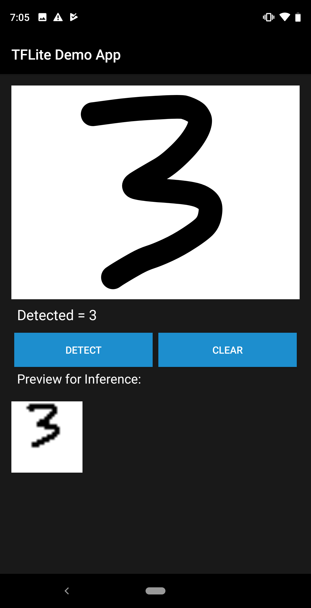

#### HandWrittenDigitClassifier-MNIST
##### Android app that uses a model trained on the MNIST dataset to detect handwritten numbers between 0 and 9.
###### MNIST .py file : https://gist.github.com/hsiaoer/aa387afa3a3c9ea970027107f5e48cdc

